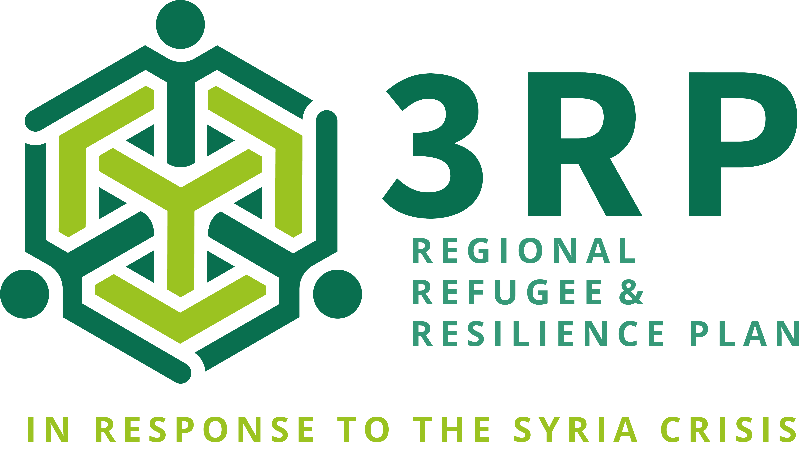

<!-- PROJECT LOGO -->
 

  

 <h3 align="center">3RP Data Collection - Agency Planning Tool</h3>
 
  
This platform efficiently handles the 3RP&#39;s information by supplying all the necessary components for the 3RP&#39;s data coordination.

Data coordination is the process of organizing, managing, and distributing data so that it is accurate, consistent, and useable. Effective data coordination is necessary for ensuring that data is accessible, dependable, and valuable and for allowing businesses to maximize their data assets.

This platform provides various crucial data coordination pieces, including:

<ul>
	<li style=‘text-align: justify;’><strong>Data governance</strong>: This involves establishing policies, procedures, and standards for managing data, including who has access to it and how it can be used. The governance is driven by 3RP guidance and is integrated into the tool steps to implement.</li>
	<li style=‘text-align: justify;’><strong>Data management</strong>: This includes storing, organizing, and protecting data, as well as ensuring that it is accurate, consistent, and up to date. An embedded data quality module ensures that the appropriate stakeholders know and address the data quality issues promptly.</li>
	<li style=‘text-align: justify;’><strong>Data sharing</strong>: It involves making data available to authorized users within an organization or beyond, including using data portals or other tools. The system allows downloading the data in excel format and sharing it with other stakeholders.</li>
	<li style=‘text-align: justify;’><strong>Data integration</strong>: This involves combining data from different sources, systems, or formats to create a single, cohesive view of the data. All the data produced in the system will be directly registered in Activity Info, and that can facilitate the follow-up and ensure that the data is well integrated with existing systems in place for planning and monitoring.</li>
</ul>

Data coordination is essential because it helps organizations use and leverage their data assets effectively and make informed, data-driven decisions. Organization, IM, Sector Leads, and Inter-Sectoral coordination groups can access the same data set during the modifications using this unique tool.

# Usage

During the package installation please use this version of activityInfo

https://github.com/MatayoBweta/activityinfo-R
